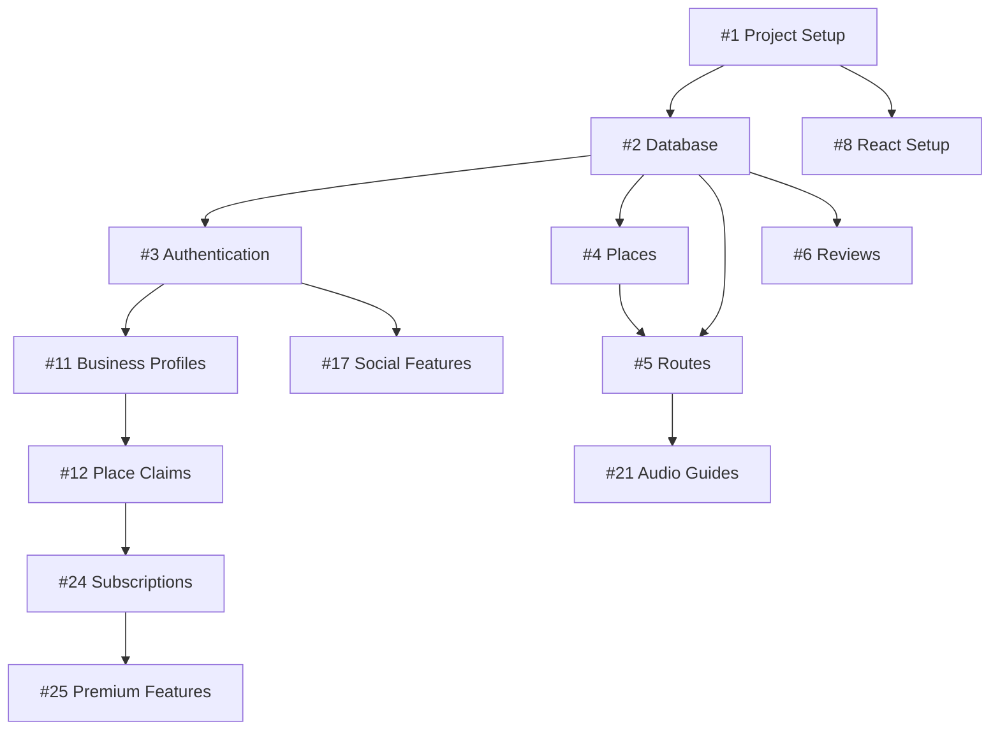

# Tripilot GitHub Issues Summary

This file provides a comprehensive overview of all GitHub issues organized by development phases.

## Quick Reference

**Total Issues:** 37  
**Total Estimated Time:** 580-730 hours (approximately 15-18 months with a team of 4-6 developers)

## Phase 1: MVP (Issues #1-10)
**Duration:** 8-10 weeks  
**Estimated Hours:** 130-170 hours  
**Goal:** Basic platform functionality with 50+ test users

| Issue # | Title | Labels | Time (hrs) |
|---------|-------|--------|------------|
| #1 | Initialize ASP.NET Core Web API project structure | `epic`, `phase-1`, `backend`, `setup` | 8-12 |
| #2 | Set up Entity Framework Core with PostgreSQL | `feature`, `phase-1`, `backend`, `database` | 10-14 |
| #3 | Implement user registration and login system | `feature`, `phase-1`, `backend`, `authentication` | 12-16 |
| #4 | Create basic Place entity and management | `feature`, `phase-1`, `backend`, `core` | 10-14 |
| #5 | Implement Route creation and management | `feature`, `phase-1`, `backend`, `core` | 14-18 |
| #6 | Create basic Review system | `feature`, `phase-1`, `backend`, `core` | 10-12 |
| #7 | Set up Google Maps API integration | `feature`, `phase-1`, `backend`, `integration` | 8-12 |
| #8 | Create React application structure | `feature`, `phase-1`, `frontend`, `setup` | 8-12 |
| #9 | Implement authentication UI components | `feature`, `phase-1`, `frontend`, `authentication` | 12-16 |
| #10 | Create place listing and search UI | `feature`, `phase-1`, `frontend`, `core` | 14-18 |

### Phase 1 Key Deliverables
- ✅ User registration and authentication
- ✅ Basic place and route management
- ✅ Simple review system
- ✅ Google Maps integration
- ✅ Mobile-responsive React application
- ✅ Core CRUD operations for all entities

## Phase 2: Core Features (Issues #11-20)
**Duration:** 6-8 weeks  
**Estimated Hours:** 126-164 hours  
**Goal:** Business features and social functionality with 500+ users, 50+ businesses

| Issue # | Title | Labels | Time (hrs) |
|---------|-------|--------|------------|
| #11 | Implement business profile system | `feature`, `phase-2`, `backend`, `business` | 12-16 |
| #12 | Create place claiming system | `feature`, `phase-2`, `backend`, `business` | 10-14 |
| #13 | Build business dashboard and analytics | `feature`, `phase-2`, `frontend`, `business` | 16-20 |
| #14 | Implement advanced search and filtering | `feature`, `phase-2`, `backend`, `search` | 12-16 |
| #15 | Add search suggestions and autocomplete | `feature`, `phase-2`, `frontend`, `search` | 10-12 |
| #16 | Implement user favorites and saved searches | `feature`, `phase-2`, `backend`, `user-experience` | 8-12 |
| #17 | Create route sharing and social features | `feature`, `phase-2`, `frontend`, `social` | 14-18 |
| #18 | Implement push notification system | `feature`, `phase-2`, `backend`, `notifications` | 12-16 |
| #19 | Add Progressive Web App features | `feature`, `phase-2`, `frontend`, `mobile` | 10-14 |
| #20 | Implement device camera integration | `feature`, `phase-2`, `frontend`, `mobile` | 8-12 |

### Phase 2 Key Deliverables
- ✅ Business user onboarding and management
- ✅ Advanced search with filters and suggestions
- ✅ Social features (sharing, following, activity feeds)
- ✅ Push notification system
- ✅ Progressive Web App capabilities
- ✅ Mobile camera integration for reviews

## Phase 3: Advanced Features (Issues #21-28)
**Duration:** 8-10 weeks  
**Estimated Hours:** 146-186 hours  
**Goal:** Premium features and AI recommendations with 2000+ users, $1000+ MRR

| Issue # | Title | Labels | Time (hrs) |
|---------|-------|--------|------------|
| #21 | Create audio guide data models and storage | `epic`, `phase-3`, `backend`, `audio-guides` | 16-20 |
| #22 | Build custom audio player component | `feature`, `phase-3`, `frontend`, `audio-guides` | 12-16 |
| #23 | Implement offline audio support | `feature`, `phase-3`, `frontend`, `audio-guides` | 14-18 |
| #24 | Create premium subscription system | `epic`, `phase-3`, `backend`, `business` | 20-24 |
| #25 | Add premium business features | `feature`, `phase-3`, `backend`, `business` | 16-20 |
| #26 | Implement user behavior tracking | `feature`, `phase-3`, `backend`, `ai-recommendations` | 12-16 |
| #27 | Create personalized recommendation engine | `feature`, `phase-3`, `backend`, `ai-recommendations` | 18-22 |
| #28 | Add smart route optimization | `feature`, `phase-3`, `backend`, `ai-recommendations` | 16-20 |

### Phase 3 Key Deliverables
- ✅ Complete audio guide system with offline support
- ✅ Premium subscription and business features
- ✅ AI-powered personalized recommendations
- ✅ Smart route optimization algorithms
- ✅ User behavior analytics and tracking
- ✅ Revenue generation through subscriptions

## Phase 4: Enterprise & Scale (Issues #29-37)
**Duration:** 6-8 weeks  
**Estimated Hours:** 178-210 hours  
**Goal:** Enterprise features and scalability with 10,000+ users, $10,000+ MRR

| Issue # | Title | Labels | Time (hrs) |
|---------|-------|--------|------------|
| #29 | Implement multi-language platform support | `epic`, `phase-4`, `backend`, `internationalization` | 20-24 |
| #30 | Create scalable architecture for 10,000+ users | `epic`, `phase-4`, `backend`, `scalability` | 24-30 |
| #31 | Build comprehensive API ecosystem | `epic`, `phase-4`, `backend`, `api` | 18-22 |
| #32 | Implement AR navigation and virtual tours | `feature`, `phase-4`, `frontend`, `ar-vr` | 25-30 |
| #33 | Add IoT and smart city integration | `feature`, `phase-4`, `backend`, `iot` | 20-24 |
| #34 | Create group trip planning features | `feature`, `phase-4`, `frontend`, `collaboration` | 16-20 |
| #35 | Implement white-label solutions | `epic`, `phase-4`, `backend`, `enterprise` | 30-35 |
| #36 | Create enterprise analytics and BI tools | `feature`, `phase-4`, `backend`, `enterprise` | 22-26 |
| #37 | Add enterprise support infrastructure | `feature`, `phase-4`, `backend`, `enterprise` | 14-18 |

### Phase 4 Key Deliverables
- ✅ Multi-language international support
- ✅ Scalable architecture for 10,000+ concurrent users
- ✅ Comprehensive API ecosystem with SDKs
- ✅ AR/VR capabilities for immersive experiences
- ✅ IoT and smart city integrations
- ✅ White-label solutions for partners
- ✅ Enterprise-grade analytics and support

## Issue Priority Matrix

### Critical Path Issues (Must Complete First)
1. **#1** - Project Structure Setup
2. **#2** - Database Setup  
3. **#8** - React Application Setup
4. **#3** - Authentication System

### High Priority Features
- **#4, #5** - Core place and route functionality
- **#9, #10** - Essential UI components
- **#11, #12** - Business user system
- **#21, #22, #23** - Audio guide system (key differentiator)

### Revenue-Generating Features
- **#24** - Premium subscriptions
- **#25** - Premium business features
- **#35** - White-label solutions
- **#36** - Enterprise analytics

### User Engagement Features
- **#17** - Social features
- **#18** - Push notifications
- **#27** - AI recommendations
- **#32** - AR/VR capabilities

## Technical Dependencies

## Resource Allocation Recommendations

### Sprint 1-2 (Weeks 1-4): Foundation
- Focus on issues #1, #2, #8 (project setup)
- Assign best backend developer to #1, #2
- Assign best frontend developer to #8
- Parallel development possible

### Sprint 3-4 (Weeks 5-8): Core Features
- Focus on issues #3, #4, #5, #9, #10
- Full team coordination needed
- End-to-end feature testing required

### Sprint 5-6 (Weeks 9-12): Business Features
- Focus on issues #11, #12, #13
- Business analyst involvement needed
- User acceptance testing critical

## Success Metrics by Phase

### Phase 1 Success Criteria
- [ ] 50+ registered test users
- [ ] 100+ places in database
- [ ] 20+ user-created routes
- [ ] Mobile responsiveness score > 95
- [ ] API response times < 200ms

### Phase 2 Success Criteria
- [ ] 500+ registered users
- [ ] 50+ verified business accounts
- [ ] 1000+ places with reviews
- [ ] 10+ daily active social interactions
- [ ] PWA install rate > 15%

### Phase 3 Success Criteria
- [ ] 2000+ registered users
- [ ] 200+ business subscriptions
- [ ] $1000+ monthly recurring revenue
- [ ] 50+ audio guides available
- [ ] AI recommendation CTR > 25%

### Phase 4 Success Criteria
- [ ] 10,000+ registered users
- [ ] Platform handles 1000+ concurrent users
- [ ] $10,000+ monthly recurring revenue
- [ ] 5+ enterprise clients
- [ ] 3+ international markets

## Next Steps

1. **Create GitHub Issues**: Copy content from phase files to GitHub issues
2. **Set Up Project Board**: Create columns and organize issues
3. **Assign Initial Issues**: Start with #1, #2, #8 for foundation
4. **Create Milestones**: Set up Phase 1-4 milestones with dates
5. **Label Issues**: Apply appropriate labels for filtering
6. **Sprint Planning**: Plan first 2-week sprint with 8-10 issues
7. **Team Coordination**: Assign issues based on expertise
8. **Monitoring Setup**: Track progress and success metrics

## Files Created

- `phase-1-issues.md` - Issues #1-10 (MVP)
- `phase-2-issues.md` - Issues #11-20 (Core Features)  
- `phase-3-issues.md` - Issues #21-28 (Advanced Features)
- `phase-4-issues.md` - Issues #29-37 (Enterprise & Scale)
- `ISSUES_MANAGEMENT_GUIDE.md` - Complete management guide
- `ISSUES_SUMMARY.md` - This summary file

Ready for GitHub issue creation and project management! 🚀